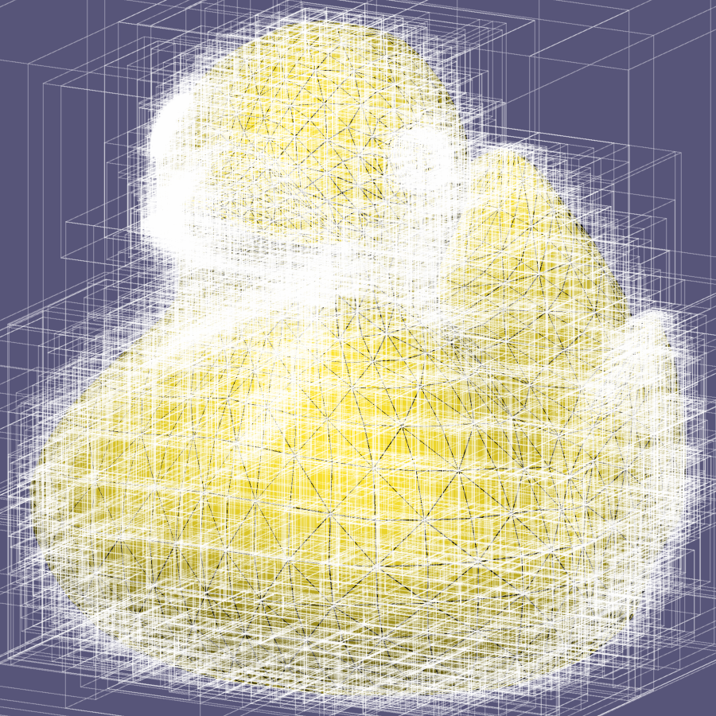
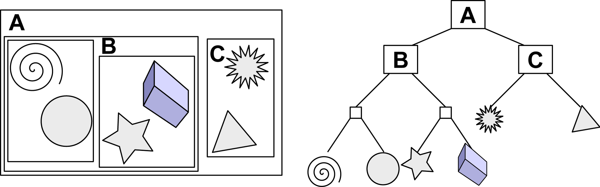
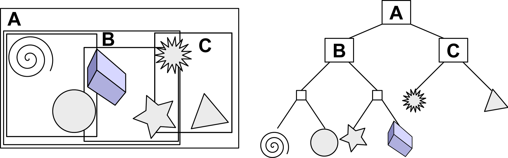
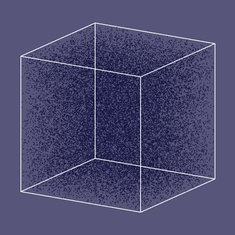
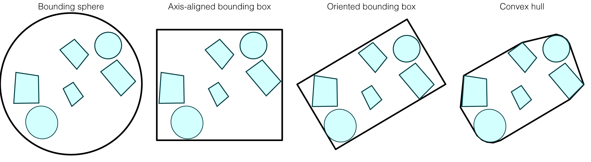
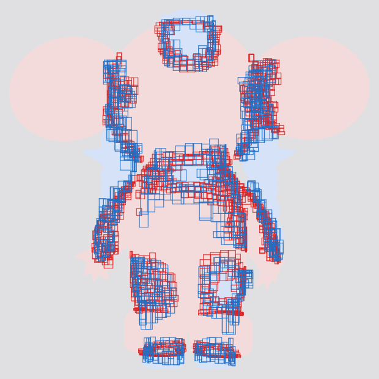

# Computer Graphics – Bounding Volume Hierarchy

> **To get started:** Clone this repository:
>
>     git clone git@github.com:panuelosj/computer-graphics-csc317-A3-BVH.git
>
> **Do not fork:** Clicking "Fork" will create a _public_ repository. If you'd
> like to use GitHub while you work on your assignment, then mirror this repo as
> a new _private_ repository:
> https://stackoverflow.com/questions/10065526/github-how-to-make-a-fork-of-public-repository-private

## Introduction

In this assignment you will build an **Axis-Aligned Bounding-Box Tree** (AABB
Tree) — one of the simplest *bounding volume hierarchies* (BVHs) — and use it to
accelerate three classic spatial queries: ray–mesh intersection, nearest-point
queries on a point cloud, and finding intersecting pairs between two meshes.

The geometry math is implemented as plain NumPy functions, so every piece is a
function you can call and test on its own; the interactive 3D view (optional)
uses `polyscope`.

## Learning objectives

By completing this assignment you will be able to:

* explain **object partitioning** (BVHs) vs. space partitioning, and when a
  hierarchy pays off;
* construct an **axis-aligned bounding-box tree** over triangles or points
  (midpoint split along the longest axis);
* implement the **slab method** for ray-box intersection and reason about
  interval arithmetic (including axis-parallel rays);
* accelerate ray-mesh intersection, nearest-neighbour search and broad-phase
  collision detection from `O(n)` toward `O(log n)`, and **measure** both the
  per-query speedup and the build-cost amortization;
* use a **priority queue** for breadth-first traversal and explain why plain
  depth-first search fails for distance queries.

## Prerequisite knowledge

* **Math**: squared distances; interval overlap; big-O reasoning.
* **Programming**: recursion and binary trees; Python classes; heaps
  (`heapq`) — including the tuple-comparison tie-break trick the stub warns
  you about.
* **Course**: A2's ray-triangle intersection and `Ray` conventions carry over
  directly.

### Prerequisite installation and setup

This assignment ships with everything it needs. From the **root of this
repository**, create its virtual environment once:

```bash
./init.sh            # macOS / Linux
# or, on Windows (PowerShell):
.\init.ps1
```

That creates `./venv` here and installs the dependencies (`numpy`, `pillow`,
`scipy`, `polyscope`). Then activate it in every new shell:

```bash
source venv/bin/activate           # macOS / Linux
# .\venv\Scripts\Activate.ps1      # Windows
```

Each assignment has its own `venv`, so activate the one belonging to the
assignment you are working on.

### Layout

    README.md            this file: background, tasks, and grading
    init.sh / init.ps1   one-time setup: creates ./venv and installs deps
    main.py              the main script that runs your code end-to-end
    run_tests.py         runs the unit checks and reports how many pass
    check_my_work.py     the same checks, but weighted by each function's allocated marks
    export_expected.py   exports the public tests' inputs and expected outputs as readable text and images
    cgcommon/            code shared by every assignment (do not edit)
    src/                 one file per function that YOU implement
    backend/             this assignment's infrastructure (BoundingBox, Ray, Object, ...) — do not edit
    tests/               the unit checks and their reference results (do not edit)
    tests/expected/      the public test data, readable (INDEX.md, .txt, .png)
    docs/images/         the sample results shown in this README
    data/                sample meshes

The `src/` directory contains *empty implementations* (stubs) of the functions
you must write. **This is the only directory you edit.** Each file documents the
function's inputs, outputs, and algorithm. Do **not** change `tests/` or
`backend/`.

### Running the demo

```bash
python main.py --mode rays         # ray–mesh intersection (default)
python main.py --mode distances    # nearest-neighbour point queries
python main.py --mode pairs        # broad-phase mesh–mesh box overlaps
```

Each demo runs a **brute-force** algorithm and the **AABB-tree-accelerated**
version side by side, warns if the two disagree, and prints a timing table. Add
`--headless` to skip the interactive `polyscope` window (it is skipped
automatically when no display is available).

### Checking your work

This repo ships with two tools that could potentially be useful for working on 
this assignment: `run_tests.py` and `check_my_work.py`.

```bash
python run_tests.py                  # PASS/FAIL table + "Validated X/12"
python run_tests.py --only ray_intersect_box   # focus on a single function
python check_my_work.py              # scores your implementation
```

`run_tests.py` tells you *what* is broken. `check_my_work.py` runs the same
checks but reports them as marks per function, so you can see where you stand
before submitting. Keep going until you see `Validated 12/12`. Note that the 
function only marks it against the public unit tests, we will also validate 
against internal examples that are not released in this repo. 

When a check fails and the message alone is not enough, look at the data it
used: [`tests/expected/`](tests/expected/INDEX.md) holds every input and
expected output the public tests compare against, written out as readable text
(and as `.png` images where the array is a picture).
You can also load the fixture directly:

```python
import numpy as np
g = np.load("tests/golden/a3_golden.npz")
print(g.files)        # every array the tests use
g["<name>"]           # one of them
```

## Sample results

A bounding volume hierarchy is a *spatial* partition of the mesh. Below,
each triangle is coloured by which subtree of the AABB tree it ends up
in, at three depths — so you can watch the hierarchy subdivide space:

| depth 1 | depth 3 | depth 5 |
|:---:|:---:|:---:|
|  |  |  |

Each colour is one node's subtree. A ray or distance query that misses a
node's box can skip every triangle of that colour at once, which is the
whole point of the structure.

## Background

### Read Section 12.3 of _Fundamentals of Computer Graphics (4th Edition)_.



*Visualization of all of the boxes of a hierarchical axis-aligned bounding-box
tree around the triangles of a [rubber
ducky](https://en.wikipedia.org/wiki/Rubber_duck) mesh.*

### Object partitioning

In this assignment, you will build an Axis-Aligned Bounding-Box
[Tree](https://en.wikipedia.org/wiki/Tree_structure) (AABB Tree). This is one of
the simplest instances of an _object partitioning_ scheme, where a group of
input objects are arranged into a [bounding volume
hierarchy](https://en.wikipedia.org/wiki/Bounding_volume_hierarchy).



*In the "scene" on the left, there are six objects. All objects fit into the
axis-aligned bounding box **A** (the root of the tree), then we cluster nearby
objects into subtrees rooted at **B** and **C**. We continue to apply this
process recursively until leaves of the tree store a single object. Tree shown
on right. ([image
source](https://commons.wikimedia.org/wiki/File:Example_of_bounding_volume_hierarchy.svg))*

In our assignment, we will build a binary tree. Conducting queries on the tree
will be reminiscent of searching for values in a [binary search
tree](https://en.wikipedia.org/wiki/Binary_search_tree). However, objects in our
tree will not be _perfectly_ sorted. In general, the bounding boxes of
"relatives" (even siblings) in our tree will overlap spatially.



*In most cases, bounding boxes will overlap. The tree topology remains the same
in this case. ([original image
source](https://commons.wikimedia.org/wiki/File:Example_of_bounding_volume_hierarchy.svg))*

By allowing bounding boxes to overlap we avoid the need to geometrically split
our objects.

> **Question:** If we use overlapping bounding boxes (i.e., no splitting) to
> build an AABB Tree, how many leaves will there be?



*The AABB Tree around a point cloud starts with a single box. The next level has
two boxes, roughly splitting the first box. This process continues recursively
until there's only a single point in the box.*

In contrast, space partitioning schemes (e.g., [kd
trees](https://en.wikipedia.org/wiki/K-d_tree) or
[octrees](https://en.wikipedia.org/wiki/Octree)) divide space _perfectly_ at
each level of the tree, with no overlapping. This makes query code easy to
write, but necessitates splitting of objects that inevitably straddle partition
boundaries.

> **Question:** Which is better for an unstructured set of points, _space
> partitioning_ or _object partitioning_?
>
> **Hint:** No perfect answer, but consider: do you ever need to split a point?

### Bounding primitives

In this assignment, we will use axis-aligned bounding boxes (AABBs) to enclose
groups of objects (e.g., points, triangles, other bounding boxes). In general,
AABBs will _not_ tightly enclose a set of objects. However, operations (e.g.,
growing the bounding box, testing ray-intersection or determining closest-point
distances with an _axis-aligned_ bounding box) usually reduce to trivial
per-component arithmetic. This means the code is simple to write/debug and also
inexpensive to evaluate.



*Minimal axis-aligned bounding boxes provide a good trade-off between tightness,
ease of construction and ease of query evaluation.*

An empty box is represented here with `min_corner = +inf` and
`max_corner = -inf`, so growing an empty box by any geometry immediately yields
the tightest box enclosing it.

### Ray-intersection queries

See Section 12.3 of _Fundamentals of Computer Graphics (4th Edition)_.

Intersecting a ray with a **solid** box uses the "slab" method: for each axis the
ray enters the slab `[min_corner, max_corner]` at one parameter and leaves at
another (watch the sign of `1/direction` — a negative component swaps which
corner is entered first). The ray hits the box if and only if the intersection of
the three per-axis intervals with `[min_t, max_t]` is non-empty. Because the box
is solid, a ray that _starts inside_ the box still counts as a hit.

### Distance queries

The recursive algorithm in _Fundamentals of Computer Graphics (4th Edition)_ for
ray-AABBTree-intersection is essentially performing a [depth first
search](https://en.wikipedia.org/wiki/Depth-first_search). The search usually
doesn't have to visit the entire tree because most boxes are not hit by the
given ray. In this way, many search paths are quickly aborted.

On the other hand, using this style of depth-first search for closest point
queries can be a disaster. Every box has _some_ closest point to our query. A
naive depth-first search could end up searching over every box before finding
the one with the smallest query.

Are we just talking about worst-case complexity for pathological arrangements
(e.g., a bunch of overlapping triangles piled at the origin)? No. Even on a
well-balanced, minimally overlapping AABB tree we could end up exploring most of
the leaves before finally finding the leaf containing the true closest point at
the very end.

This implies that we can't just explore the left or right subtrees (or their
progeny) in arbitrary order. A quick fix is to peek at the closest distance to
the boxes containing the left and right trees respectively and prefer our depth
first search in the closest direction. This helps, but we still end up
_drilling_ down to leaves when there are potentially entire large subtrees that
are closer. The problem is that depth first search is inherently
[stack](https://en.wikipedia.org/wiki/Stack_(abstract_data_type))-based and we
really want to use a [priority
queue](https://en.wikipedia.org/wiki/Priority_queue) to explore the current best
looking path in our tree wherever it might be.

> **Question:** Hey! Where's the stack in depth first search? I implemented it
> using recursion, there's no stack in my code!
>
> **[Hint](https://en.wikipedia.org/wiki/Call_stack):** Where are the
> instructions and data of your program stored?

[Breadth-first search](https://en.wikipedia.org/wiki/Breadth-first_search) is a
much better structure for distance queries on a spatial acceleration
data-structure. Pseudo-code for a closest distance algorithm might look like:

```
// initialize a queue prioritized by minimum distance
d_r ← distance to root's box
Q.insert(d_r, root)
// initialize minimum distance seen so far
d ← ∞
while Q not empty
  // d_s: distance from query to subtree's bounding box
  (d_s, subtree) ← Q.pop
  if d_s < d
    if subtree is a leaf
      d ← min[ d , distance from query to leaf object ]
    else
      d_l ← distance to left's box
      Q.insert(d_l ,subtree.left)
      d_r ← distance to right's box
      Q.insert(d_r ,subtree.right)
```

In Python the priority queue is `heapq`. Remember that `Object`s are not
orderable, so include a tie-breaking counter in each heap entry or Python will
try to compare two nodes whose distances happen to be equal.

> **Question:** If I have just a single query to conduct on a set of `n`
> objects, is it worth it to use a BVH?
>
> **Hint:** What is the complexity of _building_ a BVH? What is the complexity
> of a single brute force query?

### Intersection queries between two trees

Suppose we want to find _all pairs_ of intersecting triangles between two
meshes. One approach would be to put one mesh's triangles in an AABB tree, then
loop over the other mesh's triangles using the tree to accelerate intersection
tests. This works well if the mesh in the tree has many more triangles than the
other mesh, but can we do better if both meshes have many triangles? How about
putting both meshes in AABB trees. If the root bounding boxes don't overlap we
find out _instantaneously_ that there are no pairs of intersecting triangles. If
they do overlap, we check their childrens' boxes against each other. Anytime two
boxes don't overlap we save many expensive pairwise triangle checks. A rough
sketch of this algorithm using a simple (i.e., non prioritized) queue is like
this:

```
// initialize list of candidate leaf pairs
leaf_pairs ← {}
if root_A.box intersects root_B.box
  Q.insert( root_A, root_B )
while Q not empty
  {nodeA,nodeB} ← Q.pop
  if nodeA and nodeB are leaves
    leaf_pairs.insert( node_A, node_B )
  else if node_A is a leaf
    if node_A.box intersects node_B.left.box
      Q.insert( node_A, node_B.left )
    if node_A.box intersects node_B.right.box
      Q.insert( node_A, node_B.right )
  else if node_B is a leaf
    if node_A.left.box intersects node_B.box
      Q.insert( node_A.left, node_B)
    if node_A.right.box intersects node_B.box
      Q.insert( node_A.right, node_B)
  else
    if node_A.left.box intersects node_B.left.box
      Q.insert( node_A.left, node_B.left )
    if node_A.left.box intersects node_B.right.box
      Q.insert( node_A.left, node_B.right )
    if node_A.right.box intersects node_B.right.box
      Q.insert( node_A.right, node_B.right )
    if node_A.right.box intersects node_B.left.box
      Q.insert( node_A.right, node_B.left )
```

Careful, this sketch only considers a perfectly filled tree where nodes (and
their left/right children) are never null. [Your trees may
vary](https://en.wiktionary.org/wiki/your_mileage_may_vary).

This _**broad phase**_ identifies a set of overlapping bounding boxes containing
one triangle each. The broad phase is quick because it uses the bounding volume
hierarchy for acceleration and intersection between bounding boxes is simple and
fast. The list of candidate pairs scales with the number of _actual
intersections_ rather than the number of input triangles (as a brute force
double-for loop does). This list can then be processed using the (expensive)
triangle-triangle intersection test in a **_narrow phase_**. In this assignment
we report the broad-phase leaf-box pairs directly.



*Using an AABB Tree for each shape (light red and light blue triangle meshes), we
identify a set of candidate intersecting bounding boxes (red and blue).*

> **Question:** Suppose we want to detect intersections for a simulation of two
> deforming meshes (e.g., elastic solids bumping into each other). Can we reuse
> our AABB Tree even if the meshes are deforming? What if they're just moving
> rigidly (rotations and translations)?
>
> **Hint:** Is an axis-aligned box still axis-aligned if it's rotated 45°?

### Timing

In this assignment, we're aiming to improve the asymptotic complexity for the
[average case](https://en.wikipedia.org/wiki/Average-case_complexity). We will
not formalize the [probability
distribution](https://en.wikipedia.org/wiki/Probability_distribution) of inputs,
but instead consider uniformly random [point
clouds](https://en.wikipedia.org/wiki/Point_cloud) or real-world surface models.
The AABB Tree algorithms should behave like `O(log n)` compared to brute force
`O(n)` algorithms. For large inputs the difference should be striking.

Building the tree is itself `O(n log n)`, so that cost is paid up front and only
pays off amortized over many queries — the `distances` demo prints the
break-even query count where building the tree starts to win.

You can run each of the demos with a `--headless` flag to skip the visualization
and run only the algorithms.

## Tasks

> Every assignment, including this one, will contain a **Tasks** section. This will
> enumerate all of the tasks a student will need to complete for this assignment.

> Implementations of nearly any task you're asked to implemented in this course can be found 
> online. AI can also now fairly reliably accomplish these tasts. Do not copy these and avoid 
> googling for code or using AI; instead, search the internet for explanations. Many topics 
> have relevant wikipedia articles. Use these as references. Always remember to cite any 
> references in your comments.


You implement one function per file in `src/`. The shared types
(`BoundingBox`, `Ray`, `Object`, `MeshTriangle`, `CloudPoint`) live in
`backend/types.py` and are provided for you.

| File | What it does |
|------|--------------|
| `insert_box_into_box.py` | Grow box `B` so it also encloses box `A`. |
| `insert_triangle_into_box.py` | Grow a box so it encloses a triangle's 3 corners. |
| `ray_intersect_box.py` | Slab test: does a ray hit a *solid* AABB within `[min_t, max_t]`? |
| `ray_intersect_triangle.py` | Marschner–Shirley ray–triangle intersection. |
| `ray_intersect_triangle_mesh_brute_force.py` | `O(n)` closest ray–mesh hit (reference). |
| `AABBTree.py` | Build the hierarchy: split at the midpoint of the longest axis. |
| `AABBTree_ray_intersect.py` | Recursive, box-pruned closest ray–object query. |
| `nearest_neighbor_brute_force.py` | `O(n)` nearest point to a query (reference). |
| `point_box_squared_distance.py` | Squared distance from a point to a solid box. |
| `point_AABBTree_squared_distance.py` | Priority-queue nearest-neighbour query (not recursive!). |
| `box_box_intersect.py` | Do two AABBs overlap? (separating-axis test) |
| `find_all_intersecting_pairs_using_AABBTrees.py` | Broad phase: overlapping leaf-box pairs between two trees. |

## Grading

Your score (out of 100) comes from the unit checks in `tests/checks.py`, weighted
as follows:

| Function | Points |
|----------|-------:|
| `AABBTree` | 15 |
| `AABBTree_ray_intersect` | 10 |
| `ray_intersect_triangle` | 10 |
| `ray_intersect_box` | 10 |
| `ray_intersect_triangle_mesh_brute_force` | 10 |
| `insert_box_into_box` | 10 |
| `insert_triangle_into_box` | 10 |
| `point_AABBTree_squared_distance` | 8 |
| `nearest_neighbor_brute_force` | 6 |
| `point_box_squared_distance` | 6 |
| `find_all_intersecting_pairs_using_AABBTrees` | 3 |
| `box_box_intersect` | 2 |

The hierarchical functions are graded by **agreement with the reference
brute-force answer**: the checks build a tree with your `AABBTree` and confirm
the tree-based result matches the baked reference output, so any correct
implementation passes.

Your `src/*.py` files are graded by these same checks, as well as additional 
internal examples. Submit only your `src/` directory (all the `.py` files inside 
the folder). Do not modify `tests/` or `backend/`.

### How your mark is computed

Each function's marks are split between two sets of tests:

| | share | what it is |
|---|---:|---|
| **public** | 30% | the tests in `tests/` that ship with this assignment — the ones `run_tests.py` and `check_my_work.py` run, whose inputs and expected outputs you can read in `tests/expected/` |
| **private** | 70% | the *same* checks run against a different set of inputs |

Both tests are run in the same way, just with different data. Note that the public
test data should be sufficient to fully test your code, the private tests are just
to avoid code that simply reproduces the published numbers but does not actually 
implement the functions asked.

### Submission

Submit your completed homework on MarkUs. Open the [MarkUs](https://markus.teach.cs.toronto.edu/markus) course
page and submit all the `.py` files in your `src/` directory under
Assignment 3: Bounding Volume Hierarchy.

### Questions?

Direct your questions to the [Issues page of this
repository](https://github.com/panuelosj/computer-graphics-csc317-A3-BVH/issues).

### Answers?

Help your fellow students by answering questions or positions helpful tips on
[Issues page of this
repository](https://github.com/panuelosj/computer-graphics-csc317-A3-BVH/issues).
